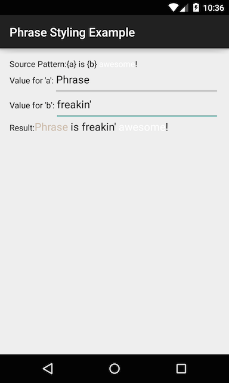

# Phrase Styling Example

Demonstrates a couple of different ways to style text with [Phrase](https://github.com/square/phrase).
Phrase uses Android's text framework, so preserves any spans on both the pattern and values.

## HTML in strings

Android supports using a subset of HTML tags to style text directly in string resource files:

Use `Resources#getText()` to parse the marked-up string into a `CharSequence`:

## Manually create `Spanned` strings

You can do the same thing from code, using `SpannableString` or `SpannableStringBuilder` to define the style:

## Screenshot

